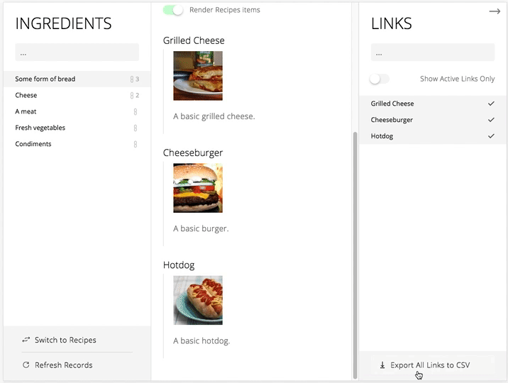

# Parity
A web app solution to consolidating data parity.

This framework provides a CMS interface, an API service, and a database for managing a many-to-many relationship.

### What is Parity?
Parity is a CMS for managing connections between two lists of items, where an item in one list could be connected to many items in the other list.

For example, the demo configures the two lists to be a list of recipes and a list of ingredients. One ingredient might be used in many different recipes, and one recipe might use many different ingredients. Parity provides a way to manage these connections between the two lists.


_Adding bread to my recipes_


_Bread shows up when viewing from recipe list_



## Installation
```
$ git clone https://fliao@code.squarespace.net/scm/~fliao/parity.git
$ git remote rm origin
$ cd parity

$ npm install
```

## Running Parity
```
$ npm run build
$ npm run start
```

Visit http://localhost:6008/ to view Parity.

## Development
### Setup
```
$ npm run dev
```

Visit http://localhost:3000/ to start watching.

Remember to configure your own database file path in `/api/config.js`.

### Writing `Half` models
The objective of Parity is to manage connections between two "halves" of a many-to-many relationship. You, the framework user, must define two models that represent these two halves. A `Half` can be visualized as an aggregate model of many "items", each of which can connect to other items in the other `Half`.

`Half` models can be defined as objects that must expose the following properties:
```javascript
{
  /*
    A human-readable title for the half. Rendered in UI.
   */
  'title': String,

  /**
   * A function that handles data retrieval on initial population, and on refresh.
   *
   * @param  {Function} callback      see callback params below
   *    @param  {Error}   err           the error to throw   
   *    @param  {Object}  itemMap       an object mapping of `_parityId`s to
   *                                    respective `Item` instances
   */
  'fetch': Function(callback),

   /**
    * A function that returns a rendering of a visual representation of a given
    * `Item` instance. Feel free to import and use your own components here.
    *
    * @param  {Object} item           the provided `Item` instance to render
    */
    'renderItem': Function(item)
}
```

See `Half` models from the demo in `/src/models`.

### `Item` data structure
Items are just object representations of singular entities within each half. You may keep whatever data in these objects that you need to render a good visual representation. However, Parity requires the following properties in order to handle these items correctly:
```javascript
{
  /*
    A unique identifier for the item. Used in linking entities.
   */
  '_parityId': String,

  /*
    A human-readable name of the item. Rendered in UI.
   */
  '_parityName': String,

  ...otherPropsYouNeed
}
```

### Adding your `Half` models to Parity
Within `src/index.js`, import your two `Half` models and add them as props to the `Parity` component instance. Order doesn't matter here; the focused half is toggle-able in the app.
```
<Parity
  LeftHalf={yourHalfModel}
  RightHalf={yourOtherHalfModel}
/>
```

## Built with
- ❤️
- [SQLite3](https://github.com/mapbox/node-sqlite3)
- [Express.js](https://github.com/expressjs/express)
- [React & `create-react-app`](https://github.com/facebook/create-react-app)

by Squarespace
